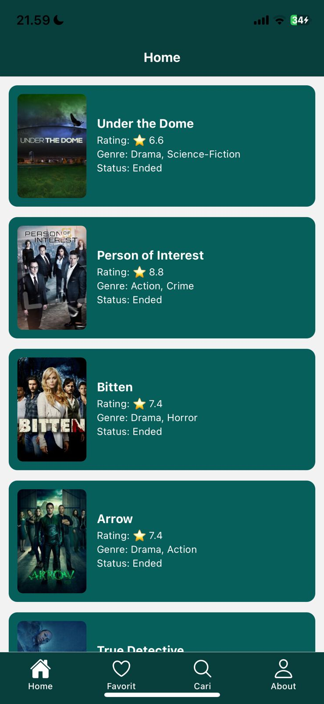
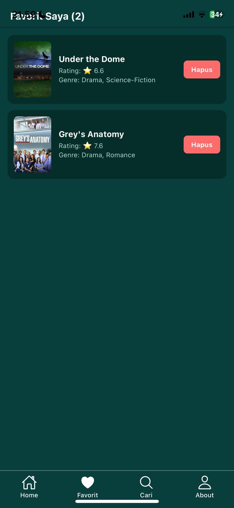
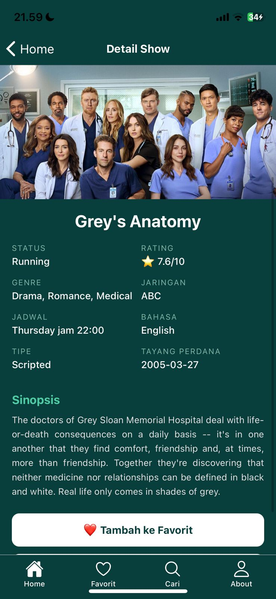
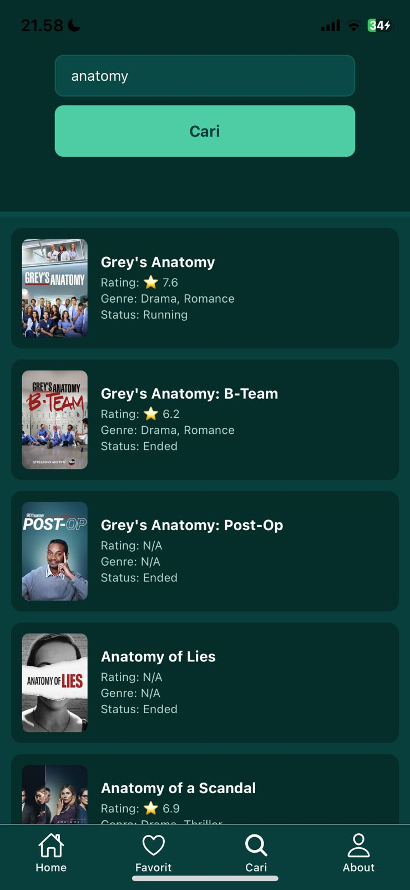
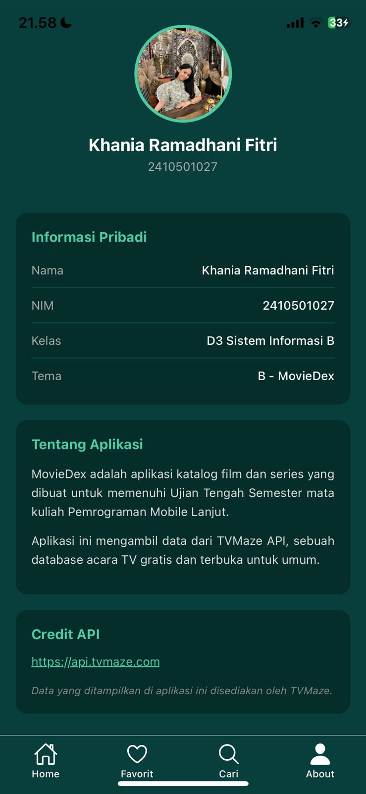

UTS Pemrograman Mobile Lanjut 

Nama: Khania Ramadhani Fitri
NIM: 2410501027  
Kelas: B
Tema: B - MovieDex 

 Deskripsi

MovieDex adalah aplikasi katalog film dan series berbasis React Native + Expo.
Aplikasi ini mengambil data dari TVMaze API dan menampilkan daftar show populer,
detail show, serta fitur favorit untuk menyimpan show kesukaan.

Tech Stack

- Framework: React Native + Expo SDK 52
- Bahasa: JavaScript
- Navigasi: @react-navigation/native + stack + bottom-tabs
- HTTP Client: fetch() API
- State Management: Context API + useReducer

Cara Install & Run

1. Clone repository ini
git clone https://github.com/USERNAME/uts-mobile-lanjut-2410501027-KhaniaRamadhani.git
2. Masuk ke folder project
cd uts-mobile-lanjut-2410501027-KhaniaRamadhani
3. install dependencies
npm install
4. jalankan aplikasi
npx expo start
5. scan qr code pakai expo go di hp

Hasil Output dengan Screenshots

Homescreen: 
FavoritesScreen: 
DetailScreen: 
SearchScreen: 
AboutScreen: 

Link Video Demo

https://drive.google.com/drive/folders/14m7eguQ2sy6shzH3OYn1ZwFEX9ZHoeo_

Penjelasan State Management + Justifikasi

State management yang saya pilih adalah Context API + useReducer.
Alasan saya memilih context API karena setup nya simpel, gak perlu install library tambahan lagi.
Lalu cocok untuk aplikasi kecil seperti MoviDex ini yang hanya butuh state favorit. Dan pada
pertemuan 4 juga sudah diajarkam, jadi sudah sedikit lebih paham alurnya.
Kalau memilih Redux, terlalu ribet untuk kasus sesimpel ini. Tapi kekurangan context 
API yaitu jika apilikasi makin besar, performa bisa turun karena re-render semua consumer. Dan juga
tidak ada built in devtools seperti Redux.

Daftar Referensi

https://youtu.be/Jx34dLSqys4?si=tsbHiu-OKjJyiyh_
https://www.tvmaze.com/api
https://reactnavigation.org/docs/getting-started
https://react.dev/reference/react/useReducer

Refleksi Pengerjaan

Selama mengerjakan UTS ini, saya menghadapi beberapa kesulitan. 
Untuk state management, saya pilih Context API karena dari awal udah agak
paham useReducer. Tapi pas implementasi, saya lupa bungkus App.js pake
provider, jadi semua screen error pas manggil useFavorites(). Untung cepet
ketemu setelah baca error messagenya. 
Masalah kedua terjadi pada bagian navigasi. Saya salah import path, tulis
../screens tapi kepotong jadi ../screens. Error-nya tidak jelas, cuma
tulis "Unable to resolve module". Saya mencari di Stack Overflow hampir 1 jam
sampai akhirnya sadar itu hanya masalah penulisan. 
Secara keseluruhan, saya belajar banyak tentang React Native, navigasi,
fetch API, dan state management. Meskipun capek dan sedikit frustasi, saya bangga bisa menyelesaikan
aplikasi ini dari nol. Ke depannya saya ingin mencoba Zustand untuk state management
karena katanya lebih simpel dari Redux.